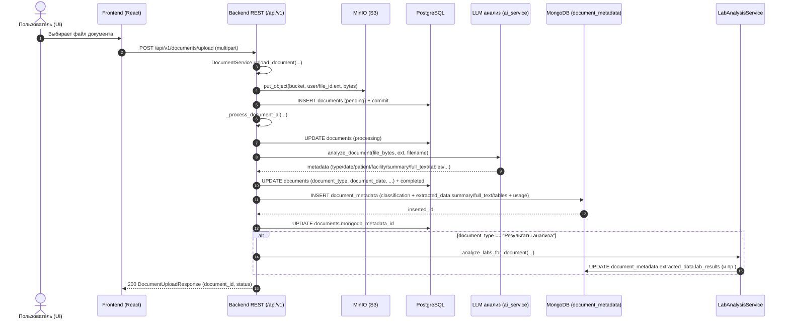
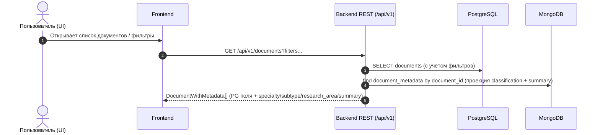
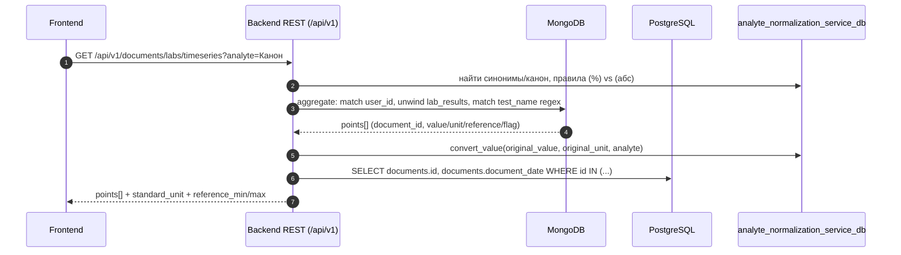
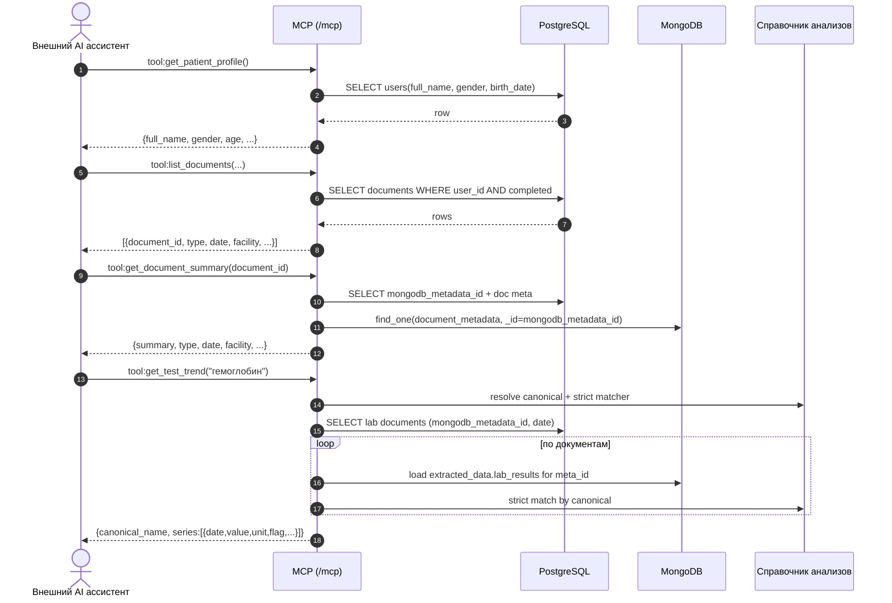

# Потоки данных MedHistory: UI API и MCP (внешние ассистенты)

Документ объясняет **движение и преобразование данных** от момента загрузки медицинского документа до использования:

- в **UI** (через REST API `backend/main.py` → `app.include_router(..., prefix="/api/v1")`)
- во **внешних AI‑ассистентах** (через **MCP** сервер, монтируется как `/mcp` при `MCP_ENABLED=true`)

Цель — быстро ответить на вопросы:

- **где лежат данные** (Postgres / MongoDB / MinIO)
- **какие шаги обработки** происходят и где именно
- **какие интерфейсы чтения** доступны и что именно они отдают

---

## Карта компонентов

### Хранилища

- **MinIO (S3)**: сырые файлы документов (`s3://<bucket>/<user_id>/<file_id>.<ext>`)
- **PostgreSQL**: индекс/каркас документа + минимальные поля для фильтрации/списков (`documents`)
- **MongoDB (`document_metadata`)**: расширенная “AI‑метадата” и извлечённые структуры (summary, full_text, tables, classification, lab_results, …)

### Сервисы обработки

- **`DocumentService`**: загрузка файла в MinIO, запись `documents`, запуск AI‑обработки, запись `document_metadata`
- **`ai_service.analyze_document(...)`**: классификация и извлечение базовых метаданных + summary + полного текстового контента
- **`LabAnalysisService.analyze_labs_for_document(...)`**: отдельный шаг извлечения результатов анализов, если документ классифицирован как “Результаты анализа”
- **`analyte_normalization_service_db`**: справочник канонических анализов + конвертация в стандартные единицы (используется и в UI, и в MCP)

### Интерфейсы

- **REST API для UI**: `/api/v1/...` (например `/api/v1/documents`)
- **MCP для внешних ассистентов**: `/mcp/...` (FastMCP streamable HTTP app)
  - Auth режимы:
    - **Phase 1**: статический bearer token (`BearerAuthMiddleware`)
    - **Phase 2**: OAuth 2.1 + DCR + consent (`MedHistoryOAuthProvider`)

---

## 1) Общий ingestion‑pipeline: от загрузки до готовых данных

### Диаграмма потока



### Что где “истина”

- **Файл** — только в **MinIO** (в Postgres хранится ссылка `file_url`)
- **Канонический список документов** (для UI списков/фильтров по дате/типу/клинике/пациенту) — **Postgres `documents`**
- **AI‑обогащение**:
  - `classification.*`, `extracted_data.summary`, `extracted_data.full_text`, `extracted_data.tables` — **Mongo `document_metadata`**
  - `extracted_data.lab_results` — **Mongo**, заполняется отдельным шагом `LabAnalysisService` (условно “пост‑обработка”)

### Ключевые преобразования

- **Классификация и текстовое извлечение документа** (LLM/парсеры): превращает “сырые байты файла” → структурные поля:
  - `document_type`, `document_date`, `patient_name`, `medical_facility`
  - `summary`, `full_text`, `tables`
  - `classification` (specialties/subtype/research_area/…)
- **Извлечение анализов** (LLM/парсер): превращает документ типа “Результаты анализа” → массив нормализуемых записей `lab_results[]` в Mongo.
- **Нормализация анализов**:
  - UI‑эндпоинт `GET /api/v1/documents/labs/timeseries` конвертирует значения в стандартные единицы через `analyte_normalization_service_db`.
  - MCP‑tools для анализов используют этот же справочник (и строгие матчеры по canonical name).

---

## 2) Интерфейс чтения для UI: REST API `/api/v1/...`

UI работает с **агрегированным представлением**: базовые поля документа берутся из Postgres, часть “умных” полей (specialties/subtype/research_area/summary/labs) — из Mongo.

### Диаграмма чтения списка документов (UI)



### “Склейка” данных (что важно помнить)

- В `GET /api/v1/documents`:
  - сначала выбираются документы из Postgres (с опциональным предварительным фильтром по Mongo‑полям через `filter_documents_by_mongodb_fields`)
  - затем делается запрос в Mongo по `document_id IN [...]` и добавляются поля `specialty`, `document_subtype`, `research_area`, `summary`
- В `GET /api/v1/documents/{id}`:
  - документ берётся из Postgres
  - затем догружается единичная запись `document_metadata` по `document_id`

### Где UI берёт “лабы”

Есть несколько уровней:

- **На уровне документа**:
  - `GET /api/v1/documents/{document_id}/labs` → сырой массив `lab_results[]` из Mongo
  - `GET /api/v1/documents/{document_id}/labs/summary` → быстрый флаг наличия и количество
- **На уровне “сквозной аналитики по анализу”**:
  - `GET /api/v1/documents/labs/analytes` → какие анализы вообще встречаются + группировка по категориям (использует справочник и Mongo‑агрегации)
  - `GET /api/v1/documents/labs/timeseries?analyte=...` → временной ряд в стандартных единицах (использует `analyte_normalization_service_db` + подтягивает даты документов из Postgres)

Диаграмма (timeseries):



---

## 3) Интерфейс чтения для внешних ассистентов: MCP `/mcp/...`

MCP сервер — отдельное приложение FastMCP, которое:

- использует **Postgres** как индекс документов/дат/типов
- использует **Mongo** как хранилище summary и структур (например `lab_results`)
- возвращает данные как **JSON‑строки** (MCP tool contract)

### Публикуемые MCP‑инструменты (на уровне `backend/mcp_server/server.py`)

- `profile`: `get_patient_profile`
- `documents`: `list_documents`, `get_document_summary`, `get_doctor_visits`
- `lab_results`: `get_lab_results`, `get_test_trend`, `list_abnormal_results`, `get_analyte_standard`
- `health_events`: (события здоровья из Mongo)
- `interpretations`: (интерпретации из Postgres)
- `search`: `search_documents` (по summary в Mongo через text index)

### Диаграмма “ассистент спрашивает → MCP отдаёт данные”



### Важная разница UI vs MCP

- **UI** получает объекты, адаптированные под фронт (`DocumentWithMetadata`, агрегированные ответы).
- **MCP** отдаёт **минимально‑достаточные JSON структуры** для reasoning ассистента:
  - summary/snippets для поиска
  - группировки/тренды по анализам
  - профайл для выбора референсов

---

## 4) Сводная схема “единый источник → два интерфейса”

```mermaid
flowchart LR
  UI[UI: React] -->|REST /api/v1| API[Backend FastAPI]
  ExtAI[External AI] -->|MCP /mcp| MCP[MCP Server (FastMCP)]

  subgraph Storage[Storage]
    S3[MinIO (raw files)]
    PG[(PostgreSQL)]
    MDB[(MongoDB document_metadata)]
  end

  API --> S3
  API --> PG
  API --> MDB

  MCP --> PG
  MCP --> MDB

  subgraph Processing[Processing]
    LLM[ai_service.analyze_document]
    Labs[LabAnalysisService]
    Norm[analyte_normalization_service_db]
  end

  API --> LLM --> PG
  LLM --> MDB
  API --> Labs --> MDB
  API --> Norm
  MCP --> Norm
```

---

## 5) Практическая “логика преобразования” по этапам

### Этап A — Загрузка

- input: файл (PDF/JPG/PNG/DOCX…)
- output:
  - MinIO: raw bytes
  - Postgres: `documents` с `file_url`, `file_hash`, `processing_status=pending`

### Этап B — AI‑анализ (классификация + summary + full_text)

- input: raw bytes
- output:
  - Postgres: `document_type`, `document_date`, `patient_name`, `medical_facility`, `processing_status=completed`
  - Mongo: `classification.*`, `extracted_data.summary`, `extracted_data.full_text`, `extracted_data.full_text_source`, `extracted_data.tables`, `ai_response.usage/model`

### Этап C — Извлечение анализов (условно)

- условие: `document_type == "Результаты анализа"`
- output:
  - Mongo: `extracted_data.lab_results[]` (сырой список измерений с единицами/флагами/референсом)

### Этап D — Потребление

- UI:
  - списки/фильтры: Postgres + (summary/classification) из Mongo
  - графики/тренды: Mongo `lab_results` + нормализация/конверсия + даты из Postgres
- MCP:
  - ассистент получает “факты”: summary, полный извлечённый текст документа (`get_document_content`), таблицы, списки документов, тренды анализов, профайл пациента

---

## 6) Где смотреть/что менять (пойнтеры в коде)

- REST API (UI): `backend/app/api/v1/router.py`, далее `backend/app/api/v1/endpoints/documents.py`
- Upload + AI pipeline: `backend/app/services/document_service.py`
- Mongo collections: `backend/app/db/mongodb.py`
- MinIO: `backend/app/db/minio_client.py`
- MCP server: `backend/mcp_server/server.py`
- MCP tools: `backend/mcp_server/tools/*.py` (documents/profile/lab_results/search/…)
