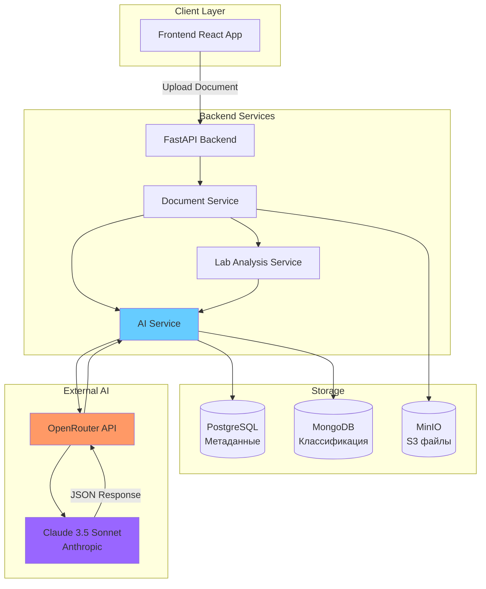
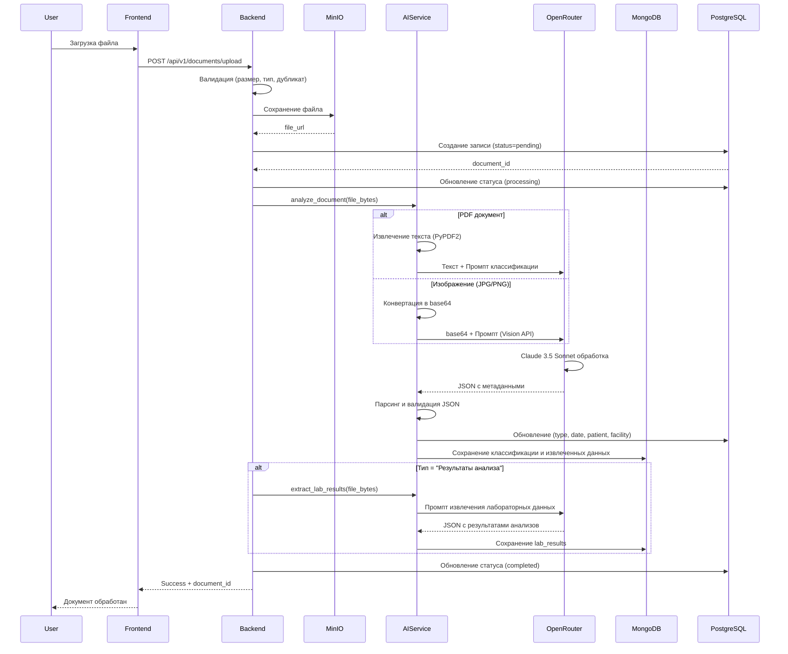
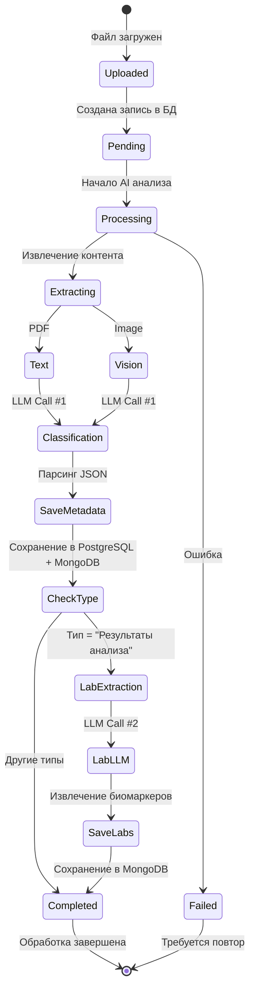
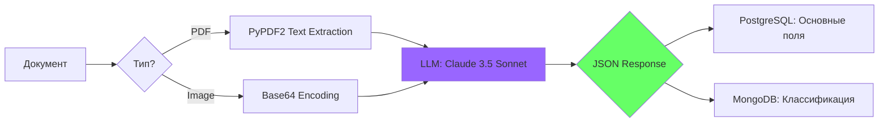
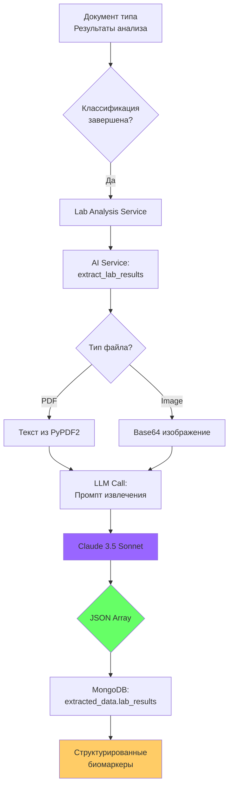

# 🤖 Архитектура работы с LLM для анализа медицинских документов

> **Дата:** 20 февраля 2026  
> **Версия:** 1.0  
> **Система:** MedHistory - личная медицинская история

---

## 📋 Содержание

1. [Общая архитектура](#общая-архитектура)
2. [Процесс обработки документов](#процесс-обработки-документов)
3. [Типы анализа](#типы-анализа)
4. [Промпты для LLM](#промпты-для-llm)
5. [Стоимость и оптимизация](#стоимость-и-оптимизация)
6. [Рекомендации по снижению затрат](#рекомендации-по-снижению-затрат)

---

## 🏗️ Общая архитектура

### Используемая инфраструктура



### Компоненты системы

| Компонент | Назначение | Технология |
|-----------|------------|------------|
| **FastAPI Backend** | API сервер | Python 3.11, FastAPI |
| **Document Service** | Управление документами | SQLAlchemy, AsyncIO |
| **AI Service** | Интеграция с LLM | httpx, OpenRouter SDK |
| **Lab Analysis Service** | Специализированный анализ лабораторных данных | Python |
| **OpenRouter** | API-шлюз для LLM | OpenRouter.ai |
| **Claude 3.5 Sonnet** | Языковая модель | Anthropic |

### Текущая конфигурация

```python
# backend/app/core/config.py
OPENROUTER_API_KEY: str = "sk-or-v1-..."
OPENROUTER_MODEL: str = "anthropic/claude-3.5-sonnet"
OPENROUTER_BASE_URL: str = "https://openrouter.ai/api/v1/chat/completions"
```

**Параметры вызова LLM:**
- `temperature: 0.1` - минимальная креативность для консистентности
- `max_tokens: 2000` - достаточно для JSON-ответа с метаданными
- `timeout: 60s` - максимальное время ожидания ответа

---

## 🔄 Процесс обработки документов

### Последовательность операций



### Этапы обработки



---

## 🎯 Типы анализа

### 1️⃣ Классификация и извлечение метаданных

**Назначение:** Определение типа документа и извлечение ключевой информации

**Вызов:** Автоматически при загрузке каждого документа

**Стоимость:** ~1 вызов на документ



**Извлекаемые данные:**

| Поле | Назначение | Хранилище |
|------|-----------|-----------|
| `document_type` | Тип документа (5 вариантов) | PostgreSQL |
| `document_date` | Дата процедуры/приема | PostgreSQL |
| `patient_name` | ФИО пациента | PostgreSQL |
| `medical_facility` | Медицинское учреждение | PostgreSQL |
| `document_subtype` | Подтип (например, "Общий анализ крови") | MongoDB |
| `research_area` | Область исследования (для УЗИ/МРТ/КТ) | MongoDB |
| `specialties` | Массив медицинских специальностей | MongoDB |
| `document_language` | Язык документа (ru/en) | MongoDB |
| `confidence` | Уверенность AI в классификации (0-1) | MongoDB |
| `summary` | Краткое содержание | MongoDB |

### 2️⃣ Извлечение лабораторных результатов

**Назначение:** Структурированное извлечение числовых показателей анализов

**Вызов:** Автоматически для документов типа "Результаты анализа"

**Стоимость:** +1 вызов дополнительно (итого 2 вызова для анализов)



**Структура извлеченных данных:**

```json
{
  "lab_results": [
    {
      "test_name": "Гемоглобин",
      "value": "145",
      "unit": "г/л",
      "reference_range": "120-160",
      "flag": "N"
    }
  ]
}
```

**Флаги интерпретации:**
- `N` - норма (Normal)
- `L` - ниже нормы (Low)
- `H` - выше нормы (High)
- `A` - аномально/критично (Abnormal)

---

## 📝 Промпты для LLM

### Промпт #1: Классификация документа

**Файл:** `backend/app/services/ai_service.py` → `_build_extraction_prompt()`

**Размер:** ~3500 символов

**Структура промпта:**

```
1. ОБЯЗАТЕЛЬНАЯ СТРУКТУРА JSON (10 строк)
   ├─ Перечисление всех полей с их типами
   └─ Примеры значений

2. ТИПЫ ДОКУМЕНТОВ (5 строк)
   ├─ Прием врача
   ├─ Результаты анализа
   ├─ Инструментальное исследование
   ├─ Функциональная диагностика
   └─ Другое

3. ПРАВИЛА ЗАПОЛНЕНИЯ ПО ТИПАМ (~150 строк)
   ├─ Прием врача
   │  ├─ Обязательные поля
   │  └─ Справочник 19 специальностей
   ├─ Результаты анализа
   │  └─ Справочник 12 подтипов
   ├─ Инструментальное исследование
   │  ├─ Справочник 8 подтипов
   │  └─ Справочники областей для УЗИ/МРТ/КТ/Рентген
   ├─ Функциональная диагностика
   │  └─ Справочник 10 подтипов
   └─ Другое

4. ОБЩИЕ ПРАВИЛА (7 пунктов)
   └─ Форматирование, обработка null, confidence

5. ВАЖНЫЕ НАПОМИНАНИЯ (3 пункта)
   └─ JSON-only, валидация структуры
```

**Ключевые особенности:**
- ✅ Строгая типизация - только 5 фиксированных типов
- ✅ Условная валидация - разные обязательные поля для разных типов
- ✅ Справочники - предопределенные списки значений (специальности, подтипы, области)
- ✅ Нормализация - единый формат (ФИО с точками, специальности как существительные)
- ✅ Confidence scoring - самооценка уверенности модели
- ✅ Трехуровневая иерархия - type → subtype → area

**Примеры ответов:**

<details>
<summary>Общий анализ крови</summary>

```json
{
  "document_type": "Результаты анализа",
  "document_subtype": "Общий анализ крови",
  "research_area": null,
  "specialties": null,
  "document_date": "2024-03-20",
  "patient_name": "Иванов И.И.",
  "medical_facility": "Инвитро",
  "document_language": "ru",
  "confidence": 0.98,
  "summary": "Результаты общего анализа крови от 20.03.2024"
}
```
</details>

<details>
<summary>Прием кардиолога</summary>

```json
{
  "document_type": "Прием врача",
  "document_subtype": null,
  "research_area": null,
  "specialties": ["Кардиология"],
  "document_date": "2024-03-15",
  "patient_name": "Сидорова М.А.",
  "medical_facility": "ГБУЗ ГКБ №1",
  "document_language": "ru",
  "confidence": 0.95,
  "summary": "Консультация кардиолога. Жалобы на боли в области сердца. Диагноз: ИБС, стенокардия напряжения."
}
```
</details>

<details>
<summary>УЗИ брюшной полости</summary>

```json
{
  "document_type": "Инструментальное исследование",
  "document_subtype": "УЗИ",
  "research_area": "Брюшная полость",
  "specialties": null,
  "document_date": "2024-03-25",
  "patient_name": "Петров А.И.",
  "medical_facility": "Клиника Семейная",
  "document_language": "ru",
  "confidence": 0.92,
  "summary": "УЗИ органов брюшной полости. Печень: размеры не увеличены. Желчный пузырь: без особенностей."
}
```
</details>

### Промпт #2: Извлечение лабораторных результатов

**Файл:** `backend/app/services/ai_service.py` → `_build_labs_extraction_prompt()`

**Размер:** ~1800 символов

**Структура промпта:**

```
1. ЗАДАЧА (2 строки)
   └─ Определить наличие и извлечь лабораторные результаты

2. СТАНДАРТИЗОВАННЫЙ ФОРМАТ JSON (12 строк)
   ├─ Структура одного биомаркера
   └─ Поля: test_name, value, unit, reference_range, flag

3. ПРАВИЛА ИЗВЛЕЧЕНИЯ (~25 строк)
   ├─ Обработка отсутствия анализов
   ├─ Форматирование названий
   ├─ Сохранение точности значений
   ├─ КРИТИЧНО: правильные единицы измерения
   │  ├─ Проценты vs абсолютные значения
   │  └─ Разные единицы = разные биомаркеры
   ├─ Определение флагов N/L/H/A
   └─ JSON-only ответ

4. ПРИМЕРЫ ПРАВИЛЬНОГО ИЗВЛЕЧЕНИЯ (4 примера)
   ├─ Лимфоциты 42% → unit: "%"
   ├─ Лимфоциты 2.5 10*9/л → unit: "10*9/л"
   ├─ Гемоглобин 145 г/л → unit: "г/л"
   └─ Гемоглобин 14.5 г/дл → unit: "г/дл"
```

**Критически важные правила:**

1. **Единицы измерения** - точное соответствие документу
   - ❌ Неправильно: смешивать % и абсолютные значения
   - ✅ Правильно: две отдельные записи для "Лимфоциты 42%" и "Лимфоциты 2.5 10*9/л"

2. **Сохранение точности** - value всегда строка, без округления
   - ❌ Неправильно: 14.5 → 15
   - ✅ Правильно: "14.5"

3. **Автоматическая интерпретация** - flag на основе reference_range
   - Если значение в диапазоне → `N`
   - Ниже минимума → `L`
   - Выше максимума → `H`
   - Критическое отклонение → `A`

**Примеры ответов:**

<details>
<summary>Биохимический анализ крови</summary>

```json
{
  "lab_results": [
    {
      "test_name": "Глюкоза",
      "value": "5.8",
      "unit": "ммоль/л",
      "reference_range": "3.9-6.1",
      "flag": "N"
    },
    {
      "test_name": "Холестерин общий",
      "value": "6.2",
      "unit": "ммоль/л",
      "reference_range": "3.0-5.2",
      "flag": "H"
    },
    {
      "test_name": "АЛТ",
      "value": "28",
      "unit": "Ед/л",
      "reference_range": "0-41",
      "flag": "N"
    }
  ]
}
```
</details>

<details>
<summary>Документ без анализов</summary>

```json
{
  "lab_results": []
}
```
</details>

---

## 💰 Стоимость и оптимизация

### Текущие тарифы OpenRouter (Claude 3.5 Sonnet)

| Операция | Стоимость | За что |
|----------|-----------|--------|
| **Input tokens** | $3.00 | за 1M токенов |
| **Output tokens** | $15.00 | за 1M токенов |
| **Image input** | $4.80 | за 1M токенов (Vision API) |

> Источник: [OpenRouter Pricing](https://openrouter.ai/anthropic/claude-3.5-sonnet)

### Расчет затрат на один документ

#### Сценарий 1: PDF документ - только классификация

```
Промпт классификации:  ~3,500 символов ≈ 875 токенов
Контент PDF (среднее):  ~5,000 символов ≈ 1,250 токенов
──────────────────────────────────────────────────────
Итого INPUT:                          2,125 токенов

JSON ответ (среднее):   ~800 символов ≈ 200 токенов
──────────────────────────────────────────────────────
Итого OUTPUT:                           200 токенов

СТОИМОСТЬ:
Input:  2,125 / 1,000,000 × $3.00  = $0.006375
Output:   200 / 1,000,000 × $15.00 = $0.003000
───────────────────────────────────────────────────
ВСЕГО НА ДОКУМЕНТ:                    $0.009375
                                    ≈ 0.94 ¢ (центов)
```

#### Сценарий 2: Изображение (JPG/PNG) - только классификация

```
Промпт классификации:  ~3,500 символов ≈ 875 токенов
Изображение (1024x768, JPEG):        ≈ 1,700 токенов (Vision)
──────────────────────────────────────────────────────
Итого INPUT:                          2,575 токенов

JSON ответ:                           ≈ 200 токенов
──────────────────────────────────────────────────────
Итого OUTPUT:                           200 токенов

СТОИМОСТЬ:
Input:  2,575 / 1,000,000 × $4.80  = $0.012360 (Vision pricing)
Output:   200 / 1,000,000 × $15.00 = $0.003000
───────────────────────────────────────────────────
ВСЕГО НА ДОКУМЕНТ:                    $0.015360
                                    ≈ 1.54 ¢ (центов)
```

#### Сценарий 3: Результаты анализа (PDF) - классификация + извлечение лабораторных данных

```
ВЫЗОВ #1 - Классификация:            $0.009375 (см. сценарий 1)

ВЫЗОВ #2 - Извлечение лабораторных данных:
Промпт извлечения:     ~1,800 символов ≈ 450 токенов
Контент PDF:           ~5,000 символов ≈ 1,250 токенов
──────────────────────────────────────────────────────
Итого INPUT:                          1,700 токенов

JSON с результатами:   ~1,500 символов ≈ 375 токенов
──────────────────────────────────────────────────────
Итого OUTPUT:                           375 токенов

СТОИМОСТЬ вызова #2:
Input:  1,700 / 1,000,000 × $3.00  = $0.005100
Output:   375 / 1,000,000 × $15.00 = $0.005625
───────────────────────────────────────────────────
ВСЕГО ЗА 2 ВЫЗОВА:                    $0.020100
                                    ≈ 2.01 ¢ (центов)
```

#### Сценарий 4: Результаты анализа (изображение) - классификация + извлечение

```
ВЫЗОВ #1 - Классификация:            $0.015360 (см. сценарий 2)

ВЫЗОВ #2 - Извлечение лабораторных данных:
Промпт извлечения:     ~1,800 символов ≈ 450 токенов
Изображение (1024x768, JPEG):        ≈ 1,700 токенов
──────────────────────────────────────────────────────
Итого INPUT:                          2,150 токенов

JSON с результатами:                  ≈ 375 токенов
──────────────────────────────────────────────────────
Итого OUTPUT:                           375 токенов

СТОИМОСТЬ вызова #2:
Input:  2,150 / 1,000,000 × $4.80  = $0.010320
Output:   375 / 1,000,000 × $15.00 = $0.005625
───────────────────────────────────────────────────
ВСЕГО ЗА 2 ВЫЗОВА:                    $0.031305
                                    ≈ 3.13 ¢ (центов)
```

### Сводная таблица стоимости

| Тип документа | Формат | Вызовов LLM | Стоимость | Центов |
|---------------|--------|-------------|-----------|--------|
| Прием врача | PDF | 1 | $0.0094 | 0.94¢ |
| Прием врача | Изображение | 1 | $0.0154 | 1.54¢ |
| Результаты анализа | PDF | 2 | $0.0201 | 2.01¢ |
| Результаты анализа | Изображение | 2 | $0.0313 | 3.13¢ |
| УЗИ/МРТ/КТ | PDF | 1 | $0.0094 | 0.94¢ |
| УЗИ/МРТ/КТ | Изображение | 1 | $0.0154 | 1.54¢ |
| ЭКГ/ЭЭГ | PDF | 1 | $0.0094 | 0.94¢ |
| ЭКГ/ЭЭГ | Изображение | 1 | $0.0154 | 1.54¢ |

**Средняя стоимость на документ:** ~$0.015 (1.5 цента)

### Прогноз затрат на разные объемы

| Документов/месяц | Средняя стоимость | Месячные затраты | Годовые затраты |
|------------------|-------------------|------------------|-----------------|
| 10 | $0.015 | $0.15 | $1.80 |
| 50 | $0.015 | $0.75 | $9.00 |
| 100 | $0.015 | $1.50 | $18.00 |
| 500 | $0.015 | $7.50 | $90.00 |
| 1,000 | $0.015 | $15.00 | $180.00 |
| 5,000 | $0.015 | $75.00 | $900.00 |
| 10,000 | $0.015 | $150.00 | $1,800.00 |

**Вывод:** Для типичного пользователя (10-50 документов/месяц) стоимость **незначительная** ($0.15-$0.75/месяц).

---

## 🎯 Рекомендации по снижению затрат

### ⚡ Немедленные оптимизации (быстрые победы)

#### 1. Кэширование результатов (экономия до 100% на повторах)

**Проблема:** Если пользователь случайно загружает один файл дважды, происходит двойной анализ.

**Решение:** Уже реализовано через `file_hash`

```python
# backend/app/services/document_service.py:62
file_hash = DocumentService._calculate_file_hash(file_content)
duplicate = await DocumentService._check_duplicate(file_hash, user_id, db)
if duplicate:
    raise ValueError("Файл уже был загружен ранее")
```

✅ **Статус:** Реализовано  
💰 **Экономия:** 100% на дубликаты

#### 2. Уменьшение max_tokens для классификации (экономия 50% output cost)

**Текущее:** `max_tokens: 2000`

**Оптимальное:** `max_tokens: 1000`

**Обоснование:** JSON ответ классификации занимает 200-400 токенов, 1000 более чем достаточно.

```python
# backend/app/services/ai_service.py:203
payload = {
    "model": self.model,
    "messages": messages,
    "max_tokens": 1000,  # ← Изменить с 2000
    "temperature": 0.1
}
```

💰 **Экономия:** ~$0.003 на документ (25%)

#### 3. Оптимизация промпта классификации (экономия 30% input cost)

**Текущий промпт:** ~3,500 символов (875 токенов)

**Оптимизированный промпт:** ~2,500 символов (625 токенов)

**Как оптимизировать:**
- ✂️ Убрать дублирующиеся объяснения
- ✂️ Сократить примеры справочников (оставить по 3-5 вместо всех)
- ✂️ Убрать избыточные напоминания
- ✅ Сохранить критическую структуру и правила

**Пример оптимизации:**

```diff
- Справочник специальностей: Терапия, Кардиология, Неврология, Гастроэнтерология, 
- Эндокринология, Урология, Оториноларингология (ЛОР), Офтальмология, Травматология 
- и ортопедия, Дерматология, Инфекционные болезни, Ревматология, Пульмонология, 
- Нефрология, Онкология, Хирургия, Акушерство и гинекология, Педиатрия, Психиатрия, 
- Другая специальность

+ Справочник специальностей: Терапия, Кардиология, Неврология, Гастроэнтерология, 
+ Эндокринология и др. (полный список см. в системе)
```

💰 **Экономия:** ~$0.002 на документ (20%)

### 🚀 Средние оптимизации (требуют разработки)

#### 4. Асинхронная обработка через очередь задач (экономия на failover)

**Проблема:** Если анализ падает (timeout, ошибка API), весь запрос пользователя падает.

**Решение:** Внедрить очередь задач (Celery, RQ, или ARQ)

```python
# Текущая реализация
await DocumentService._process_document_ai(document, file_content, file_ext, db)

# Оптимизированная реализация
await task_queue.enqueue(
    'process_document_ai',
    document_id=document.id,
    priority='normal',
    retry=3,
    retry_delay=60
)
```

**Преимущества:**
- Повторные попытки при ошибках
- Не блокирует пользователя
- Возможность batch обработки

💰 **Экономия:** Косвенная - меньше повторных вызовов при ошибках

#### 5. Умное извлечение лабораторных данных (экономия 50% на call #2)

**Проблема:** Второй вызов для извлечения лабораторных данных происходит ВСЕГДА для "Результаты анализа".

**Решение:** Анализировать только если в summary упоминаются числовые значения.

```python
# backend/app/services/document_service.py:169
if document.document_type == "Результаты анализа":
    # Умная проверка: есть ли числовые данные?
    if metadata.summary and has_numeric_values(metadata.summary):
        await LabAnalysisService.analyze_labs_for_document(...)
```

💰 **Экономия:** ~$0.010 на 50% документов анализов

#### 6. Пре-обработка изображений (экономия до 40% на Vision API)

**Проблема:** Vision API очень дорогой ($4.80 vs $3.00)

**Решение:** OCR для изображений ПЕРЕД отправкой в LLM

**Подходы:**
1. **Tesseract OCR** (бесплатно, локально)
2. **Amazon Textract** ($1.50 per 1000 pages)
3. **Google Cloud Vision OCR** ($1.50 per 1000 images)

**Сравнение стоимости:**

| Метод | Стоимость | Качество | Скорость |
|-------|-----------|----------|----------|
| Claude Vision | $0.015 | ⭐⭐⭐⭐⭐ | Медленно |
| Textract → Claude Text | $0.011 | ⭐⭐⭐⭐ | Средне |
| Tesseract → Claude Text | $0.009 | ⭐⭐⭐ | Быстро |

```python
# Оптимизированная обработка изображений
if file_type in ['jpg', 'jpeg', 'png']:
    # Сначала OCR
    text_content = await ocr_service.extract_text(file_bytes)
    
    if len(text_content) > 100:  # Если текст извлечен успешно
        # Используем текстовый промпт (дешевле)
        messages = [{"role": "user", "content": f"{prompt}\n\n{text_content}"}]
    else:
        # Фолбэк на Vision API
        messages = [{"role": "user", "content": [{"type": "text", ...}, {"type": "image_url", ...}]}]
```

💰 **Экономия:** ~$0.005 на изображение (33%)

### 🎓 Стратегические оптимизации (долгосрочные)

#### 7. Переход на более дешевые модели для простых задач

**Claude 3.5 Sonnet** - очень мощная, но дорогая модель.

**Альтернативы:**

| Модель | Input | Output | vs Sonnet |
|--------|-------|--------|-----------|
| Claude 3.5 Sonnet | $3.00 | $15.00 | baseline |
| Claude 3.5 Haiku | $0.80 | $4.00 | **4x дешевле** |
| GPT-4o Mini | $0.15 | $0.60 | **20x дешевле** |
| GPT-4o | $2.50 | $10.00 | 1.3x дешевле |

**Стратегия:** Использовать Haiku или GPT-4o Mini для классификации, Sonnet только для сложных случаев.

```python
# Умный выбор модели
if is_simple_document(document):  # Стандартный формат анализа
    model = "anthropic/claude-3.5-haiku"
else:  # Нестандартный формат, рукописный текст
    model = "anthropic/claude-3.5-sonnet"
```

💰 **Экономия:** До 75% на простых документах

#### 8. Batch обработка похожих документов

**Идея:** Объединять несколько документов одного типа в один вызов.

**Когда применимо:**
- Пользователь загружает 10 анализов крови подряд
- Все документы от одного пациента из одной лаборатории

**Пример:**

```python
# Вместо 10 вызовов по $0.009 = $0.09
for doc in documents:
    analyze_document(doc)

# Один вызов на $0.035
analyze_batch(documents)  # Общий контекст, batch inference
```

💰 **Экономия:** До 60% на batch

#### 9. Fine-tuning собственной модели

**Когда имеет смысл:** > 10,000 документов/месяц

**Преимущества:**
- Более точная классификация
- Меньшие промпты (модель обучена на домене)
- Возможность использования локальной модели

**Варианты:**
1. Fine-tune GPT-4o Mini - $5.00 per 1M training tokens
2. Fine-tune Llama 3.1 70B - бесплатно, локально
3. Train custom small model - полный контроль

💰 **Экономия:** До 90% после окупания обучения

#### 10. Локальная модель для классификации

**Модели для рассмотрения:**
- **Llama 3.1 70B** - качество близко к Claude
- **Mistral Medium** - хороший баланс
- **Qwen 2.5 32B** - быстрая, эффективная

**Инфраструктура:**
- vLLM для инференса
- GPU сервер (NVIDIA A100/H100)

**Break-even analysis:**

```
GPU сервер (RTX 4090): $1,500 one-time + $0.20/hour electricity
Break-even: 
- 1000 docs/month: никогда
- 10,000 docs/month: ~12 месяцев
- 50,000 docs/month: ~3 месяца
```

💰 **Экономия:** 100% после break-even, но требует инфраструктуры

---

## 📊 Сводная таблица рекомендаций

| № | Оптимизация | Сложность | Экономия | Приоритет | Срок |
|---|-------------|-----------|----------|-----------|------|
| 1 | Кэширование дубликатов | ✅ Done | 100% на дубликаты | ⭐⭐⭐⭐⭐ | - |
| 2 | Уменьшение max_tokens | 🟢 Easy | 25% | ⭐⭐⭐⭐⭐ | 1 час |
| 3 | Оптимизация промпта | 🟢 Easy | 20% | ⭐⭐⭐⭐ | 2 часа |
| 4 | Очередь задач | 🟡 Medium | Косвенная | ⭐⭐⭐⭐ | 1 день |
| 5 | Умное извлечение лабораторных данных | 🟡 Medium | 50% на call #2 | ⭐⭐⭐⭐ | 3 часа |
| 6 | OCR для изображений | 🟡 Medium | 33% на изображения | ⭐⭐⭐ | 1 день |
| 7 | Дешевые модели для простых задач | 🟡 Medium | 75% на простых | ⭐⭐⭐ | 2 дня |
| 8 | Batch обработка | 🔴 Hard | 60% на batch | ⭐⭐ | 1 неделя |
| 9 | Fine-tuning | 🔴 Hard | 90% после обучения | ⭐ | 1 месяц |
| 10 | Локальная модель | 🔴 Hard | 100% после break-even | ⭐ | 2 месяца |

### Рекомендованный план действий

#### Фаза 1: Быстрые победы (1 день работы)
1. ✅ Уменьшить `max_tokens` с 2000 до 1000
2. ✅ Оптимизировать промпт классификации (убрать избыточность)
3. ✅ Умное извлечение лабораторных данных (проверка на числовые значения)

**Экономия:** ~40% на документ, ~$0.006 → ~$0.0036

#### Фаза 2: Средние улучшения (1 неделя работы)
4. ✅ Внедрить очередь задач (Celery/RQ)
5. ✅ Добавить OCR для изображений (Tesseract + fallback to Vision)
6. ✅ Умный выбор модели (Haiku для простых, Sonnet для сложных)

**Экономия:** еще ~50%, ~$0.0036 → ~$0.0018

#### Фаза 3: Долгосрочная (по необходимости)
7. ⏳ Batch обработка (если пользователи загружают много документов сразу)
8. ⏳ Fine-tuning (если > 10,000 документов/месяц)
9. ⏳ Локальная модель (если > 50,000 документов/месяц)

---

## 📈 Итоговая экономика

### Текущая стоимость
- **Средний документ:** $0.015 (1.5¢)
- **100 документов/месяц:** $1.50
- **1,000 документов/месяц:** $15.00

### После Фазы 1 (быстрые победы)
- **Средний документ:** $0.009 (0.9¢) ⬇️ **40%**
- **100 документов/месяц:** $0.90 ⬇️ **$0.60**
- **1,000 документов/месяц:** $9.00 ⬇️ **$6.00**

### После Фазы 2 (средние улучшения)
- **Средний документ:** $0.0045 (0.45¢) ⬇️ **70%**
- **100 документов/месяц:** $0.45 ⬇️ **$1.05**
- **1,000 документов/месяц:** $4.50 ⬇️ **$10.50**

### ROI на оптимизацию

Если тратить 2 дня разработки (16 часов × $50/час = $800):

| Объем | Месячная экономия | Break-even | Годовая экономия |
|-------|-------------------|------------|------------------|
| 100 docs/month | $1.05 | 63 месяца | $12.60 |
| 500 docs/month | $5.25 | 13 месяцев | $63.00 |
| 1,000 docs/month | $10.50 | 6 месяцев | $126.00 |
| 5,000 docs/month | $52.50 | 1.3 месяца | $630.00 |
| 10,000 docs/month | $105.00 | 0.6 месяца | $1,260.00 |

**Вывод:** Оптимизация имеет смысл при объеме **> 500 документов/месяц**.

---

## 🔍 Мониторинг и метрики

### Рекомендуемые метрики для отслеживания

```python
# Добавить в MongoDB
{
  "llm_metrics": {
    "calls_count": 2,
    "total_input_tokens": 3825,
    "total_output_tokens": 575,
    "total_cost_usd": 0.0201,
    "models_used": ["anthropic/claude-3.5-sonnet"],
    "processing_time_seconds": 12.5
  }
}
```

### Dashboard метрик

Рекомендуется отслеживать:
1. **Средняя стоимость на документ** по типам
2. **Распределение токенов** (input/output)
3. **Процент изображений vs PDF** (изображения дороже)
4. **Частота повторных вызовов** (ошибки, неудачи)
5. **Время обработки** (SLA)

---

## 📚 Дополнительные материалы

### Полезные ссылки

- [OpenRouter Documentation](https://openrouter.ai/docs)
- [Claude 3.5 Sonnet Pricing](https://openrouter.ai/anthropic/claude-3.5-sonnet)
- [Anthropic Best Practices](https://docs.anthropic.com/en/docs/build-with-claude/prompt-engineering)
- [Token Counting Guide](https://help.openai.com/en/articles/4936856-what-are-tokens-and-how-to-count-them)

### Контакты

**Вопросы по документу:**
- Команда разработки MedHistory
- Email: team@medhistory.local

---

**Последнее обновление:** 20 февраля 2026  
**Версия документа:** 1.0  
**Статус:** ✅ Актуально
